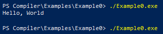

# Compiler / Translator

The first and main goal of this project is to present a working compiler from a simple made-up language. To such an end, there is a **front end**, a **middle stage**, and a **back end**. 

The **front end** is composed of a <u>lexer</u> and a <u>parser</u>. The lexer reads predefined tokens from a file and builds a stream that the parser can read. Additionally, any variables or string literals found are added to a symbol table that is used throughout the compilation process. The parser reads through the token stream and builds a syntax tree out of the stream. There are two different sets of rules for the parser. One set is a context free grammar (CFG), which relies on first-token sets that dictate unique left-to-right pathways through any valid token stream. The other set is also a CFG, but it is instead dictated by unique middle tokens. This second set allows for appropriate application of precedence rules in expressions.

The **middle stage** crawls the bulky syntax tree that results from the parser and builds an optimized, bare-bones syntax tree that represents the entirety of the program without containing any elements that will not be used by the back end. This is achieved by binding predefined elements that will be used by the compiler with different parse rules and tokens. In this way, the syntax tree can be crawled to find these basic elements, building a valid, optimized tree meanwhile. To accommodate grammar rules that do not lend themselves easily to syntax trees as the back-end expects them, the language can define reflow rules adjust the primary syntax tree to the final optimized counterpart. 

The **back end** is composed of an <u>assembler</u> and an interface with the <u>compiler of the assembler</u>. This stage is TBD. At the moment, the aim is to create a generalized assembler with links to assembly language Java classes, which with carefully chosen methods can output the code from the assembler without knowing the specific assembly language in question. Finally, the assembly language in question will indicate the assembly compiler command line directive, which will generate the final executable file.

To assist in development, there is also a Python translator. 

 

## See also

* Grammar
  * There is a [full listing of the grammar](README/LANGUAGE.md "Prepackaged Language Information") for the prepackaged language with all sorts of interesting additional information on how parsing occurs.
  * The [grammar development spreadsheet](README/GrammarAndReflow.xlsx "Grammar Development Spreadsheet") in the README folder is a more detailed representation of this information in the prior link.
  * There is a [collection of flow diagrams](README/Grammar.drawio "Grammar Flow Diagrams") that can be opened with [draw.io (external link)](http://draw.io). Screen captures from these flow diagrams can be found on the [grammar explanation page](README/LANGUAGE.md "Prepackaged Language Information"), linked above.
* Optimization
  * See the in-depth [explanation of optimization and reflow](README/OPTIMIZATION.md "Explanation of Optimization and Reflow") for more information on how optimization takes place in this package.

## Goals
Below are listed the goals of the program.

1. Create a working compiler corresponding to a simple, made-up language.

2. Allow for custom-designed of language plug-ins, so that the compiler can work with any language, given a properly-designed plug-in. This would include:

<ul>
<li>Tokens as the designer desires.</li>
<li>Any CFG rules to utilize the custom token set, with their relations to the elemental code constructs.</li>
</ul>

3. Allow for the selection of any back-end compiler, given a properly-created assembly language plug-in.

 

## Front End

### Lexer

Consider the following code.

	// Run a condition then output Hello, World
	if (true) {
		echo "Hello, World\n";
	}

The lexer will step through the code file and convert it to tokens. Along the way, it will add any variables to the symbol table. Additionally, it adds strings to the symbol table, which will later be gathered into a global string pool. 

After the lexer has run, there will be a stream of tokens ready to be read. For the above code, it is represented by the following.

	Token: COMMENT   	( // Run a condition then output Hello, World )
	Token: IF        	( if )
	Token: PAREN_OPEN	( ( )
	Token: TRUE      	( true )
	Token: PAREN_CLOS	( ) )
	Token: CURLY_OPEN	( { )
	Token: ECHO      	( echo )
	Token: STRING    	( "Hello, World\n" )
	Token: SEMICOLON 	( ; )
	Token: CURLY_CLOS	( } )
	Token: EOF       	(   )

Of course the tokens found by the lexer do not represent the actual language constructs. They are raw building blocks from which the parser can construct a syntax tree.

### Parser

The parser will then take the above tokens, and using the CFG rules, will construct a raw syntax tree. For the above code, it can be represented by the following XML structure.

	// Raw parse tree
	
	<_PROGRAM_ element="SCOPE">
	  <_STMTS_ element="REFLOW_LIMIT">
	    <_IF_ element="PASS">
	      <IF element="IF" value="if" />
	      <PAREN_OPEN value="(" />
	      <_EXPR_ element="PASS">
	        <_VALUE_ element="PASS">
	          <_LITERAL_ element="PASS">
	            <TRUE element="LITERAL" value="true" />
	          </_LITERAL_>
	        </_VALUE_>
	      </_EXPR_>
	      <PAREN_CLOSE value=")" />
	      <_SCOPE_ element="SCOPE">
	        <_BLOCKSTMT_ element="PASS">
	          <_BLOCK_ element="PASS">
	            <CURLY_OPEN value="{" />
	            <_STMTS_ element="REFLOW_LIMIT">
	              <_BLOCKSTMT_ element="PASS">
	                <_STMT_ element="PASS">
	                  <_ECHO_ element="OUTPUT">
	                    <ECHO value="echo" />
	                    <_EXPR_ element="PASS">
	                      <_VALUE_ element="PASS">
	                        <_LITERAL_ element="PASS">
	                          <STRING element="LITERAL" value="&quot;Hello, World\n&quot;" type="STRING" />
	                        </_LITERAL_>
	                      </_VALUE_>
	                    </_EXPR_>
	                  </_ECHO_>
	                  <SEMICOLON value=";" />
	                </_STMT_>
	              </_BLOCKSTMT_>
	              <STMTS />
	            </_STMTS_>
	            <CURLY_CLOSE value="}" />
	          </_BLOCK_>
	        </_BLOCKSTMT_>
	      </_SCOPE_>
	      <ELSE />
	    </_IF_>
	    <STMTS />
	  </_STMTS_>
	</_PROGRAM_>

That is a bulky structure for such a simple program! However, this is an unambiguous syntax tree that results directly from the CFG rule set for this language. Nevertheless, it would be quite a challenge for an assembler to make sense of such a bulky structure. For this reason, we create an optimizer to clean the tree before passing it to the assembler.

For more information on the grammar, see the [prepackaged language information](README/LANGUAGE.md "Prepackaged Language Information") page.

 

## Middle Stage

### Optimizer

You may have noticed that some of the XML elements above have a parameter called "element". This is the key to optimization. CFG rules bind to these elemental programming constructs, which the assembler can understand. The optimizer crawls the syntax tree, finds these elements, and builds a simplified tree from them. 

	// Optimized syntax tree, stage 1
	
	<SCOPE NonTerminal="_PROGRAM_">
	  <REFLOW_LIMIT NonTerminal="_STMTS_">
	    <IF Terminal="IF" value="if" />
	    <LITERAL Terminal="TRUE" value="true" />
	    <SCOPE NonTerminal="_SCOPE_">
	      <REFLOW_LIMIT NonTerminal="_STMTS_">
	        <OUTPUT NonTerminal="_ECHO_">
	          <LITERAL Terminal="STRING" value="&quot;Hello, World\n&quot;" type="STRING" />
	        </OUTPUT>
	      </REFLOW_LIMIT>
	    </SCOPE>
	  </REFLOW_LIMIT>
	</SCOPE>

This is certainly better, but what are these `<REFLOW_LIMIT>` elements? There are certain language constructs that do not lend themselves nicely to an easy-to-assemble tree. Thus, languages may be retrofitted with "reflow bindings". These are rules that tell the optimizer how to rearrange the syntax tree such that the language constructs are properly understood. 

The optimizer then executes these reflow bindings. For this code, it is to send the `LITERAL` into `IF` as a condition and to send `SCOPE` into `IF` as the true condition code.

	// Optimized syntax tree, stage 2
	
	<SCOPE NonTerminal="_PROGRAM_">
	  <REFLOW_LIMIT NonTerminal="_STMTS_">
	    <IF Terminal="IF" value="if">
	      <LITERAL Terminal="TRUE" value="true" />
	      <SCOPE NonTerminal="_SCOPE_">
	        <REFLOW_LIMIT NonTerminal="_STMTS_">
	          <OUTPUT NonTerminal="_ECHO_">
	            <LITERAL Terminal="STRING" value="&quot;Hello, World\n&quot;" type="STRING" />
	          </OUTPUT>
	        </REFLOW_LIMIT>
	      </SCOPE>
	    </IF>
	  </REFLOW_LIMIT>
	</SCOPE>

The reflow rules have been applied! Whereas before , the `IF` block had no children (`<IF Terminal="IF" value="if" />`), it now appropriately has a condition and the true-condition code (`<IF Terminal="IF" value="if">...</IF>`). 

Finally, the optimizer removes any basic elements that are labeled as temporary. In this case, these are the `REFLOW_LIMIT` nodes. The result is a fully-optimized syntax tree. (See the [optimization information](README/OPTIMIZATION.md "Optimization Information Page") page for more information on elemental constructs and reflow.)

	// Optimized syntax tree, final stage
	
	<SCOPE>
	  <IF value="if">
	    <LITERAL value="true" />
	    <SCOPE>
	      <OUTPUT>
	        <LITERAL value="&quot;Hello, World\n&quot;" type="STRING" />
	      </OUTPUT>
	    </SCOPE>
	  </IF>
	</SCOPE>

What an improvement over the raw syntax tree that resulted directly from the parser! This tree is ready to go on to the next stage.

 

## Back End

**Note!** This step is still in progress. Initially, it is being built with [GoAsm](http://www.godevtool.com/ "GoAsm Homepage"), which can compile into Windows executables as well as Linux executables. Using a stepped abstraction from the assembler Java code to the resulting assembly language Java class, the code should be extendable into other assembly languages as subclasses of AssyLanguage.java.

### Assembler

The assembler then crawls through the optimized syntax tree and outputs appropriate assembly code. For a Windows executable using GoAsm, the resulting assembly code for the above code is shown below.

	; This code generated by com.zygateley.compiler
	
	Data Section
	    str0	DB	"Hello, World",10
	    inputHandle	DD	0
	    outputHandle	DD	0
	    tempGlobal	DD	64 Dup 0
	
	Code Section
	start:
	    ; Prepare environment for input and output
	    ; Get input handle
	    Push -10D                           ; Parameter for GetStdHandle
	    Call GetStdHandle
	    Mov [inputHandle], Eax              ; Save input handle
	    ; Get output handle
	    Push -11D                           ; Parameter for GetStdHandle
	    Call GetStdHandle
	    Mov [outputHandle], Eax             ; Save output handle
	    
	    ; Open scope
	    ; Prepare if-then conditional
	    ; If true, go to label0
	    ; Finally, go to label1
	    ; Prepare operand
	    Mov Ebx, 0                          ; Clear register for new usage
	    Mov Eax, 1D
	    Mov Ebx, 1                          ; assemble operand TRUE
	    Cmp Ebx, 0                          ; Determine if condition is false
	    Jz > label1                         ; If condition is false, jump
	    label0:
	        ; Open scope
	        ; Output
	        ; Prepare operand
	        Mov Ecx, 0                      ; Clear register for new usage
	        Mov Eax, 12D
	        Mov Ecx, Addr str0              ; assemble operand LITERAL
	        ; Caller save registers
	        Push Ebx                        ; Anonymous value added to stack
	        Push Ecx                        ; Anonymous value added to stack
	        Push 0                          ; Parameter for WriteConsoleA
	        Push Addr tempGlobal            ; Parameter for WriteConsoleA
	        Push Eax                        ; Parameter for WriteConsoleA
	        Push Ecx                        ; Parameter for WriteConsoleA
	        Push [outputHandle]             ; Parameter for WriteConsoleA
	        Call WriteConsoleA
	        ; Caller restore registers
	        Pop Ecx                         ; Anonymous value removed from stack
	        Pop Ebx                         ; Anonymous value removed from stack
	        
	        ; Close scope
	        
	    
	    label1:
	    
	    ; Close scope
	    
	    Ret                                 ; Program finish

Thanks to the simplicity of the original, the assembly code is relatively compact. Certain aspects of the language demand includes of additional assembly files, such as those seen in `src/main/resources`. These may include the output of integer values (byte integers must be converted to ASCII strings) or the storing of strings to variables (non-string-pool strings must have their lengths determined on-the-fly&ndash;Java does not necessarily know at compile time). There are many more interesting challenges to solve in the coming updates to this project!

### Compiler

The code then accesses the assemblers internal compiler to generate the final executable. In the case of GoAsm on Windows, a compiler and linker (link to kernel32.dll) must be run. From Java, you will see something along the lines of the following.

	GoAsm.exe output:
		GoAsm.Exe Version 0.61.0.1 - Copyright Jeremy Gordon 2001-2017 - JG@JGnet.co.uk
		Output file: Example0.obj
		
	
	GoLink.exe output:
		GoLink.Exe Version 1.0.2.3 - Copyright Jeremy Gordon 2002-2016 - JG@JGnet.co.uk
		Output file: Examples/Example0/Example0.exe
		Format: Win32   Size: 2,048 bytes

Shown below is the output of the **final executable** when it is run!

### Translator

To assist in development, a Python translator was created. The above code will result in the following code. It's about as simple as you can get, but it demonstrates the accuracy of the syntax tree!

	# Python code automatically generated by 
	# com.zygateley.compiler.PythonTranslator::toPython
	
	if True:
	    print ("Hello, World\n")

## In Development

There are quite a few items still to be done. See the [.TODO file](.TODO "TODO File") for an updated list. 