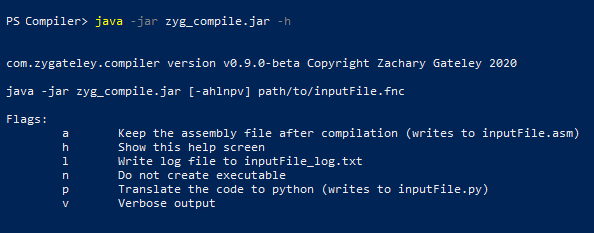
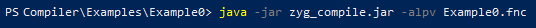

# Multi-Pass Compiler / Python Transpiler

The first and main goal of this project is to present a working compiler from a simple made-up language. To such an end, there is a **front end**, a **middle stage**, and a **back end**, all described in greater detail in the sections below. For an up-to-date demonstration of the currently-available backend functionalities, [please see Example1](Examples/Example1 "Demonstration of currently-available backend functionalities").

 

## (Some) Highlights

* **Grammar**
  * There is a [full listing of the grammar](README/LANGUAGE.md "Prepackaged Language Information") for the prepackaged language with all sorts of interesting additional information on how parsing occurs.
  * The [grammar development spreadsheet](README/GrammarAndReflow.xlsx "Grammar Development Spreadsheet") in the README folder is a more detailed representation of this information in the prior link.
  * There is a [collection of flow diagrams](README/Grammar.drawio "Grammar Flow Diagrams") that can be opened with [draw.io (external link)](http://draw.io). Screen captures from these flow diagrams can be found on the [grammar explanation page](README/LANGUAGE.md "Prepackaged Language Information"), linked above.
* **Optimization**
  * See the in-depth [explanation of optimization and reflow](README/OPTIMIZATION.md "Explanation of Optimization and Reflow") for more information on how optimization takes place in this package.
* **Assembly**
  * [Please see Example1](Examples/Example1 "Demonstration of currently-available backend functionalities") for an up-to-date demonstration of current assembly functionalities.
  * Once you are working in assembly, the game changes, and procedures that you might normally take for granted become visible hurdles. If you look into the [assembly resources folder](src/main/resources/), you can see the helper functions designed for the challenges so far overcome. These include...
    * Converting integers to strings so that they can be output in human-readable forms (ASCII). Boolean values are also converted, but their code was short enough not to demand an additional assembly file.
    * **String concatenation** opens up a big can of worms. You must know the lengths of each individual string. You must allocate new memory with the new length. Then you must move the strings one-by-one to the new memory allocation. What to do if one of the operands is not a string? You must convert it to ASCII first. Furthermore, what do you do with the heap allocation?!
    * Thus, my **memory allocation solution**. When a new scope is opened, a heap allocation table is initialized for that scope. This table holds the number of current allocations, the allocation capacity of the table, and free space to store addresses of heap memory allocations. At the moment, this table has a generous, but static, capacity of 256 addresses. When the scope is closed, each of the heap allocations is freed, and the table itself is freed. In other words, this compiler has **automatic garbage collection** run when variables are out of scope.

## Goals

Below are listed the goals of the program.

1. <s>Create a working compiler corresponding to a simple, made-up language. Run a lexer, parser, optimizer, and assembler on it. Following, compile and link the assembly code. </s>
2. Add support for more complex language constructs such as functions and arrays.
3. Allow for custom-designing of language plug-ins, so that the compiler can work with any language, given a properly-designed plug-in. Ideally, at least a simple form of almost any language could be built as a language plugin for this compiler.
4. Allow for the selection of any back-end compiler (e.g. MIPS, Masm, etc.), given a properly-created assembly language plug-in.

 

## Command Line Execution

Download and run the `zyg_compile.jar` file to start compiling your own code! See below help menu for usage.

There are four different output files that may be generated by the compiler: a log file (`-l`), an assembly file (`-a`), an executable file (turn off with `-n`), and a python translation (`-p`). All flags should be under the same command-line parameter as shown above. 

There is no constraint on the extension of the file you attempt to compile. It only matters that the source is valid ASCII code.

Notice! Running this JAR file will unpack the GoAsm executables and a custom assembly library file to compile the generated assembly code. These will create a directory `GoAsm/` in the directory the JAR is executed from. These will only be unpacked if they do not already exist. The intention is to make this code's usage as easy as possible. [More about GoAsm](http://godevtool.com).

# Explanation of Functionality

For the following [example](Examples/Example0/), you may imagine that the following command line code was executed

## Front End

### Lexer

Consider the following code.

	// Run a condition then output Hello, World
	if (true) {
		echo "Hello, World\n";
	}

The lexer will step through the code file and convert it to tokens. Along the way, it will add any variables to the symbol table. Additionally, it adds strings to the symbol table, which will later be gathered into a global string pool. 

After the lexer has run, there will be a stream of tokens ready to be read. For the above code, it is represented by the following.

	Token: COMMENT   	( // Run a condition then output Hello, World )
	Token: IF        	( if )
	Token: PAREN_OPEN	( ( )
	Token: TRUE      	( true )
	Token: PAREN_CLOS	( ) )
	Token: CURLY_OPEN	( { )
	Token: ECHO      	( echo )
	Token: STRING    	( "Hello, World\n" )
	Token: SEMICOLON 	( ; )
	Token: CURLY_CLOS	( } )
	Token: EOF       	(   )

Of course the tokens found by the lexer do not represent the actual language constructs. They are raw building blocks from which the parser can construct a syntax tree.

### Parser

The parser will then take the above tokens, and using the CFG rules, will construct a raw syntax tree. For the above code, it can be represented by the following XML structure.

	// Raw parse tree
	
	<_PROGRAM_ element="SCOPE">
	  <_STMTS_ element="REFLOW_LIMIT">
	    <_IF_ element="PASS">
	      <IF element="IF" value="if" />
	      <PAREN_OPEN value="(" />
	      <_EXPR_ element="PASS">
	        <_VALUE_ element="PASS">
	          <_LITERAL_ element="PASS">
	            <TRUE element="LITERAL" value="true" />
	          </_LITERAL_>
	        </_VALUE_>
	      </_EXPR_>
	      <PAREN_CLOSE value=")" />
	      <_SCOPE_ element="SCOPE">
	        <_BLOCKSTMT_ element="PASS">
	          <_BLOCK_ element="PASS">
	            <CURLY_OPEN value="{" />
	            <_STMTS_ element="REFLOW_LIMIT">
	              <_BLOCKSTMT_ element="PASS">
	                <_STMT_ element="PASS">
	                  <_ECHO_ element="OUTPUT">
	                    <ECHO value="echo" />
	                    <_EXPR_ element="PASS">
	                      <_VALUE_ element="PASS">
	                        <_LITERAL_ element="PASS">
	                          <STRING element="LITERAL" value="&quot;Hello, World\n&quot;" type="STRING" />
	                        </_LITERAL_>
	                      </_VALUE_>
	                    </_EXPR_>
	                  </_ECHO_>
	                  <SEMICOLON value=";" />
	                </_STMT_>
	              </_BLOCKSTMT_>
	              <STMTS />
	            </_STMTS_>
	            <CURLY_CLOSE value="}" />
	          </_BLOCK_>
	        </_BLOCKSTMT_>
	      </_SCOPE_>
	      <ELSE />
	    </_IF_>
	    <STMTS />
	  </_STMTS_>
	</_PROGRAM_>

That is a bulky structure for such a simple program! However, this is an unambiguous syntax tree that results directly from the CFG rule set for this language. Nevertheless, it would be quite a challenge for an assembler to make sense of such a bulky structure. For this reason, we create an optimizer to clean the tree before passing it to the assembler.

For more information on the grammar, see the [prepackaged language information](README/LANGUAGE.md "Prepackaged Language Information") page.

 

## Middle Stage

### Optimizer

You may have noticed that some of the XML elements above have a parameter called "element". This is the key to optimization. CFG rules bind to these elemental programming constructs, which the assembler can understand. The optimizer crawls the syntax tree, finds these elements, and builds a simplified tree from them. 

	// Optimized syntax tree, stage 1
	
	<SCOPE NonTerminal="_PROGRAM_">
	  <REFLOW_LIMIT NonTerminal="_STMTS_">
	    <IF Terminal="IF" value="if" />
	    <LITERAL Terminal="TRUE" value="true" />
	    <SCOPE NonTerminal="_SCOPE_">
	      <REFLOW_LIMIT NonTerminal="_STMTS_">
	        <OUTPUT NonTerminal="_ECHO_">
	          <LITERAL Terminal="STRING" value="&quot;Hello, World\n&quot;" type="STRING" />
	        </OUTPUT>
	      </REFLOW_LIMIT>
	    </SCOPE>
	  </REFLOW_LIMIT>
	</SCOPE>

This is certainly better, but what are these `<REFLOW_LIMIT>` elements? There are certain language constructs that do not lend themselves nicely to an easy-to-assemble tree. Thus, languages may be retrofitted with "reflow bindings". These are rules that tell the optimizer how to rearrange the syntax tree such that the language constructs are properly understood. 

The optimizer then executes these reflow bindings. For this code, it is to send the `LITERAL` into `IF` as a condition and to send `SCOPE` into `IF` as the true condition code.

	// Optimized syntax tree, stage 2
	
	<SCOPE NonTerminal="_PROGRAM_">
	  <REFLOW_LIMIT NonTerminal="_STMTS_">
	    <IF Terminal="IF" value="if">
	      <LITERAL Terminal="TRUE" value="true" />
	      <SCOPE NonTerminal="_SCOPE_">
	        <REFLOW_LIMIT NonTerminal="_STMTS_">
	          <OUTPUT NonTerminal="_ECHO_">
	            <LITERAL Terminal="STRING" value="&quot;Hello, World\n&quot;" type="STRING" />
	          </OUTPUT>
	        </REFLOW_LIMIT>
	      </SCOPE>
	    </IF>
	  </REFLOW_LIMIT>
	</SCOPE>

The reflow rules have been applied! Whereas before , the `IF` block had no children (`<IF Terminal="IF" value="if" />`), it now appropriately has a condition and the true-condition code (`<IF Terminal="IF" value="if">...</IF>`). 

Finally, the optimizer removes any basic elements that are labeled as temporary. In this case, these are the `REFLOW_LIMIT` nodes. The result is a fully-optimized syntax tree. (See the [optimization information](README/OPTIMIZATION.md "Optimization Information Page") page for more information on elemental constructs and reflow.)

	// Optimized syntax tree, final stage
	
	<SCOPE>
	  <IF value="if">
	    <LITERAL value="true" />
	    <SCOPE>
	      <OUTPUT>
	        <LITERAL value="&quot;Hello, World\n&quot;" type="STRING" />
	      </OUTPUT>
	    </SCOPE>
	  </IF>
	</SCOPE>

What an improvement over the raw syntax tree that resulted directly from the parser! This tree is ready to go on to the next stage.

 

## Back End

The current compiler plugin is [GoAsm](http://www.godevtool.com/ "GoAsm Homepage"), which can compile into Windows as well as Linux executables. Using a stepped abstraction from the assembler Java code to the resulting assembly language Java class, in future revisions, the code should be extendable into other assembly languages as subclasses of AssyLanguage.java.

### Assembler

The assembler crawls through the optimized syntax tree composed solely of so-called **elementary language constructs** and outputs appropriate assembly code. For a Windows executable using GoAsm, the resulting assembly code for the above source code is shown below.

	; This code was automatically generated by
	; com.zygateley.compiler.Assembler#assemble
	; using the GoAsm assembly language
	
	Data Section
	    ; String pool
	    str0			DB	"Hello, World",10,0
	    trueString		DB	"TRUE",0
	    falseString		DB	"FALSE",0
	    
	    ; Other global variables
	    heapHandle		DD	0
	    inputHandle		DD	0
	    outputHandle	DD	0
	    tempGlobal		DD	64 Dup 0
	
	Code Section
	start:
	    ; Prepare environment for input and output
	    ; Get process heap handle
	    Call GetProcessHeap
	    Mov [heapHandle], Eax               ; Save heap handle
	    ; Get input handle
	    Push -10D                           ; Parameter for GetStdHandle
	    Call GetStdHandle
	    Mov [inputHandle], Eax              ; Save input handle
	    ; Get output handle
	    Push -11D                           ; Parameter for GetStdHandle
	    Call GetStdHandle
	    Mov [outputHandle], Eax             ; Save output handle
	    
	    ; Open scope
	    Mov Eax, 1028D                      ; Create heap allocation pool
	    Push Eax                            ; Anonymous value added to stack
	    Push 0                              ; Anonymous value added to stack
	    Push [heapHandle]                   ; Anonymous value added to stack
	    Call HeapAlloc
	    Mov W[Eax], 0                       ; Number of current allocations
	    Mov W[Eax + 2], 256                 ; Current allocation capacity
	    Mov Ebx, Eax                        ; Address of heap allocation pool
	    Push Ebx                            ; Linked variable added to stack
	    ; Prepare if-then conditional
	    ; If true, go to label0
	    ; Finally, go to label1
	    ; Prepare operand
	    Mov Eax, 1D
	    Mov Ecx, 1                          ; assemble operand TRUE
	    Push Ecx                            ; Linked variable added to stack
	    Cmp Ecx, 0                          ; Determine if condition is false
	    Jz >> label1                        ; If condition is false, jump
	    label0:
	        ; Open scope
	        Mov Eax, 1028D                  ; Create heap allocation pool
	        Push Eax                        ; Anonymous value added to stack
	        Push 0                          ; Anonymous value added to stack
	        Push [heapHandle]               ; Anonymous value added to stack
	        Call HeapAlloc
	        Mov W[Eax], 0                   ; Number of current allocations
	        Mov W[Eax + 2], 256             ; Current allocation capacity
	        Mov Edx, Eax                    ; Address of heap allocation pool
	        Push Edx                        ; Linked variable added to stack
	        ; Output
	        ; Prepare operand
	        Mov Eax, 13D
	        Mov Esi, Addr str0              ; assemble operand LITERAL
	        Push Esi                        ; Linked variable added to stack
	        Push 0                          ; Anonymous value added to stack
	        Push Addr tempGlobal            ; Anonymous value added to stack
	        Push Eax                        ; Anonymous value added to stack
	        Push [Esp + 12D]                ; Anonymous value added to stack
	        Push [outputHandle]             ; Anonymous value added to stack
	        Call WriteConsoleA
	        
	        Push [Esp + 4D]                 ; Anonymous value added to stack
	        Push [heapHandle]               ; Anonymous value added to stack
	        Call free_heap_allocations
	        Add Esp, 8D                     ; Close scope​	   
		label1:
	    Push [Esp + 4D]                     ; Anonymous value added to stack
	    Push [heapHandle]                   ; Anonymous value added to stack
	    Call free_heap_allocations
	    Add Esp, 8D                         ; Close scope
	    
	    Ret                                 ; Program finish

Despite the simplicity of the original code, the assembly code, while relatively compact, has quite a bit of bulk! The main source of the code above is the handling of garbage collection. The most pertinent highlights of the code are the conditional jump (in this case, `Cmp` always results in the zero bit set to 0) at `label0` and the 10 lines following the `; Output` comment. The code takes advantage of GoAsm handling the data storage and address of `str0` ("Hello, World\n", defined on line 7), then calls Windows console API to write to the STD output stream.

Certain aspects of the language demand includes of additional assembly files. These may include the output of integer values (byte integers must be converted to ASCII strings) or the storing of strings to variables (non-string-pool strings must have their lengths determined on-the-fly; Java does not necessarily know at compile time). There are certainly many more interesting challenges to overcome in the coming development!

You may see these resources files in the [GoAsm resources folder](/src/main/resources/assembly/goasm/resources). They have been compiled to `com.zygateley.compiler.obj` in their parent folder via the batch file a few directories up.

### Compiler

The code then accesses the assemblers internal compiler to generate the final executable. In the case of GoAsm on Windows, a compiler and linker (link to kernel32.dll) must be run. From Java, you will see something along the lines of the following.

	GoAsm.exe output:
		GoAsm.Exe Version 0.61.0.1 - Copyright Jeremy Gordon 2001-2017 - JG@JGnet.co.uk
		Output file: Example0.obj	
	
	GoLink.exe output:
		GoLink.Exe Version 1.0.2.3 - Copyright Jeremy Gordon 2002-2016 - JG@JGnet.co.uk
		Output file: Examples/Example0/Example0.exe
		Format: Win32   Size: 2,048 bytes

Shown below is the output of the **final executable** when it is run!

### Python Transpiler

To assist in development, a Python transpiler was created. The above code results in the following python script. It's about as simple as you can get, but it demonstrates the accuracy of the syntax tree!

	# Python code automatically generated by 
	# com.zygateley.compiler.PythonTranslator::toPython
	
	if True:
	    print ("Hello, World\n")
