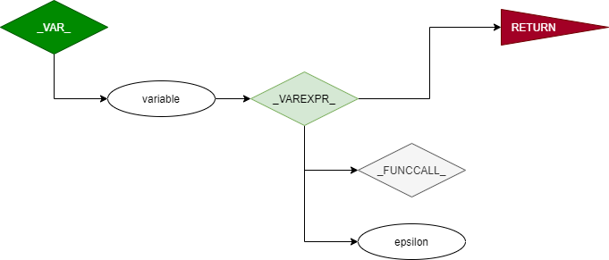
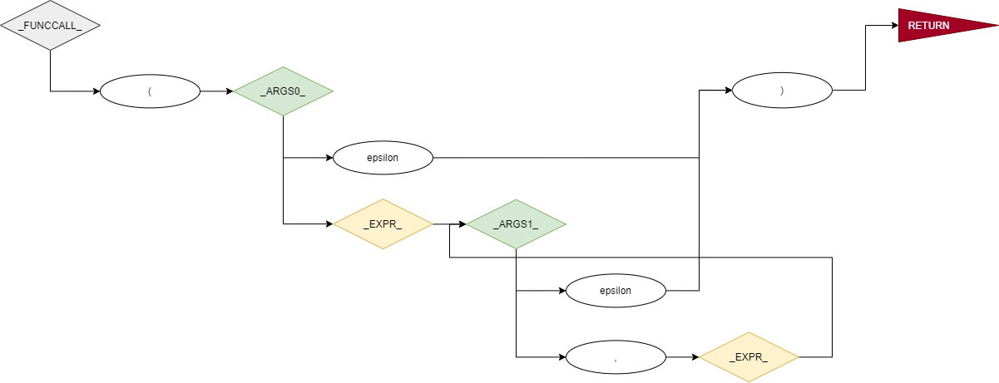

# Default Language

The pre-packaged language is exceptionally simple, and while not particularly interesting as a language itself, it exemplifies the power (and limitations) of the compiler. 


## Example code

At the time of writing, the simple grammar can be almost fully understood by the example code below.

```
// Function definitions have JavaScript style
function console_out(first, second, third, which) {
	// Conditions must be included in parentheses
	if (which == "first") {
		// Output has a shell or php style, without the dollar signs
		echo first;
	}
	else if (which == "second") {
		// if, else if, and else follow Java syntax
		echo second;
	}
	// Conditional blocks can be enclosed in curly braces or can be single lines
	else echo third;
}

// All statements must end in a semicolon
echo "\nPlease enter which to echo: \"first\" or \"second\"";

// Input follows the style of dBase
input which;

_selection_ = "\nYou selected ";
selection_1 = _selection_ + "first.";
selection_2 = _selection_ + "second.";

// Function calls include parentheses
// If there are parameters, they are comma delimited
// Arguments may be expressions instead of just literals or variables
console_out(selection_1, selection_2, "\nWe " + "don't know what that is.", which);

// There exist few operators, but for those that are included,
// order of operations holds
calc = 1 *2 + -3 / (6 - -4);
echo "\nSimple calculation: ";
echo calc;
```


## Grammar

If you are unfamiliar with Context Free Grammars and their respective FIRST and FOLLOW sets, I encourage you to research that before diving into the following. The following content represents the rules of the default grammar. 

The grammar for this language was designed with the intention of making it as concise as possible. At the same time, as you will see on the [optimization information](OPTIMIZATION.md "Optimization Information Page") page, some of these rules also have additional bindings not listed here. In some cases, making this CFG less concise was appropriate for maintaining simple bindings.

Notes:

* **Terminal** names have <u>no</u> prefix or suffix.
* **Non-Terminal** names have a <u>single underscore</u> prefix and suffix.
* <span style="color:#0000aa">**Non-Terminal**</span> names of rules *that do not have unique first and follow sets* have a <u>double underscore</u> prefix and suffix.

| Non-Terminals |      | Production Rule                                              | FIRST SET {}                                 | FOLLOW SET {}                         |
| ------------- | ---- | ------------------------------------------------------------ | -------------------------------------------- | ------------------------------------- |
| `_PROGRAM_`     | →    | `_STMTS_` \| `EMPTY`                                           | `FUNCTION`, `IF`, {, `<stmts>`,  `EMPTY`      | `EOF`                                   |
| `_STMTS_`       | →    | `_FUNCDEF_` `_STMTS_` \| `_IF_` `_STMTS_` \| `_BLOCKSTMT_` `_STMTS_` \|  `EMPTY` | `FUNCTION`, `IF`, {, `<stmts>`, `EMPTY`       | `EOF`, }                                |
| `_FUNCDEF_`     | →    | `FUNCTION` `VAR` ( `_PARAMS0_` ) `_SCOPE_`                        | `FUNCTION`                                     | `EOF`, }, `<_STMTS_.FIRST>`               |
| `_PARAMS0_`     | →    | `VAR` `_PARAMS1_` \| `EMPTY`                                     | `VAR`, `EMPTY`                                 | )                                     |
| `_PARAMS1_`     | →    | , `VAR` `_PARAMS1_` \| `EMPTY`                                   | `comma`, `EMPTY`                             | )                                     |
| `_SCOPE_`       |      | `_BLOCKSTMT_`                                                  | {, `<stmts>`                                 | `EOF`, }, `<_STMTS_.FIRST>`, `ELSE` |
| `_IF_`          | →    | `IF` ( `_EXPR_` ) `_SCOPE_` `_ELSE_`                             | `IF`                                        | `EOF`, }, `<_STMTS_.FIRST>`               |
| `_ELSE_`        | →    | `ELSE` `_ELSEIF_` \| `EMPTY`                              | else, `EMPTY`                        | `EOF`, }, `<_STMTS_.FIRST>`               |
| `_ELSEIF_`      |      | `IF` ( `_EXPR_` ) `_SCOPE_` `_ELSE_` \| `_SCOPE_`                |                                              |                                       |
| `_BLOCKSTMT_`   | →    | `_BLOCK_` \| `_STMT_`                                            | {, `<stmts>`                                 | `EOF`, }, `<_STMTS_.FIRST>`, `ELSE` |
| `_BLOCK_`       | →    | { `_STMTS_` }                                                  | {                                            | `EOF`, }, `<_STMTS_.FIRST>`, `ELSE` |
| `_STMT_`        | →    | `_ECHO_`; \| `_INPUT_` `VAR`; \| `VAR` `_VARSTMT_`; \| `comment`     | `<stmts>` | `EOF`, }, `<_STMTS_.FIRST>`, `ELSE` |
| `_ECHO_`        | →    | `ECHO` `_EXPR_`                                                  | `ECHO`                                         | ;                                     |
| `_INPUT_`       | →    | `INPUT` `VAR`                                                    | `INPUT`                                        | ;                                     |
| `_VARSTMT_`     | →    | `_VARDEF_` \| `_FUNCCALL_`                                       | =, (                                         | ;                                     |
| `_VARDEF_`      | →    | = `_EXPR_`                                                     | =                                            | ;                                     |
| `_EXPR_`        | →    | <span style="color:#0000aa">`__PRECEDENCE1__`</span>                                            | `<terminal>`                                 | ), ;, `COMMA`                     |
| <span style="color:#0000aa">`__PRECEDENCE1__`</span> | →    | <span style="color:#0000aa">`__PRECEDENCE1__`</span> `<operatorsPrecedence1>` <span style="color:#0000aa">`__PRECEDENCE2__`</span> | N/A                                          | N/A |
| <span style="color:#0000aa">`__PRECEDENCE2__`</span> | →    | <span style="color:#0000aa">`__PRECEDENCE2__`</span> `<operatorsPrecedence2>` <span style="color:#0000aa">`__PRECEDENCE3__`</span> | N/A                                          | N/A |
| <span style="color:#0000aa">`__PRECEDENCE3__`</span> | →    | <span style="color:#0000aa">`__PRECEDENCE3__`</span> `<operatorsPrecedence3>` <span style="color:#0000aa">`__PRECEDENCE4__`</span> | N/A                                          | N/A |
| <span style="color:#0000aa">`__PRECEDENCE4__`</span> | →    | <span style="color:#0000aa">`__PRECEDENCE4__`</span> `<operatorsPrecedence4>` <span style="color:#0000aa">`__PRECEDENCE5__`</span> | N/A                                          | N/A |
| <span style="color:#0000aa">`__PRECEDENCE5__`</span> |      | <span style="color:#0000aa">`__PRECEDENCE5__`</span> `<operatorsPrecedence5>` `_VALUE_`     | N/A                                          | N/A |
| `_VALUE_`       | →    | `_VAR_` \| `_LITERAL_`                                           | `VAR`, `<primitives>`                          | `<ops>`, ;, comma, )                  |
| `_VAR_`         | →    | `VAR` `_VAREXPR_`                                                | `VAR`                                          | `<ops>`, ;, comma, )                  |
| `_VAREXPR_`     | →    | `_FUNCCALL_` \| `EMPTY`                                        | (, `EMPTY`                                   | `<ops>`, ;, comma, )                  |
| `_FUNCCALL_`    | →    | ( `_ARGS0_` )                                                  | (                                            | `<ops>`, ;, comma, )                  |
| `_ARGS0_`       | →    | `_EXPR_` `_ARGS1_` \| `EMPTY`                                    | (, `VAR`, `<primitives>`, `PLUS`, `MINUS`, `EMPTY` | )                                     |
| `_ARGS1_`       | →    | , `_EXPR_` `_ARGS1_` \| `EMPTY`                                  | `COMMA`, `EMPTY`                         | )                                     |
| `_LITERAL_`     | →    | `BOOLEAN`\| `INT` \| `STRING`                | `<primitives>`                               | `<ops>`, ;, comma, )                  |
|               |      |                                                              |                                              |                                       |
| **Terminals** |  | **Match**                                                    | **Precedence Set**                           | **Token Set**                         |
| `EMPTY`       | →    | "" (Empty string, $\varepsilon$)                 |                                              |                                       |
| `SEMILCOLON`  | →    | ";"                                                          |                                              |                                       |
| `COMMA`       | →    | ","                                                          |                                              |                                       |
| `EQ`          | →    | "=" (indicates variable definition)                          |                                              |                                       |
| `PAREN_OPEN`  | →    | "("                                                          |                                              |                                       |
| `PAREN_CLOSE` | →    | ")"                                                          |                                              |                                       |
| `CURLY_OPEN`  | →    | "{"                                                          |                                              |                                       |
| `CURLY_CLOSE` | →    | "}"                                                          |                                              |                                       |
| `SQUARE_OPEN` | →    | "["                                                          |                                              |                                       |
| `SQUARE_CLOSE` | →    | "]"                                                          |                                              |                                       |
| `COMMENT`     | →    | "//" to "\r\|\n\|\f"                                         |                                              | $\in$ `<primitives>` |
| `TRUE`        | →    | "true"                                                       |                                              | $\in$ `<primitives>`                  |
| `FALSE`       | →    | "false"                                                      |                                              | $\in$ `<primitives>` |
| `INT`         | →    | r/\\d*/                                                      |                                              | $\in$ `<primitives>` |
| `STRING`      | →    | String enclosed in quotes (escaped quotes does not terminate  string) |                                              | $\in$ `<primitives>` |
| `FUNCTION`      | →    | "function"                                            |                                              |                                       |
| `IF`          | →    | "if"                                                         |                                              | $\in$ `<stmts>` |
| `ELSE`        | →    | "else"                                                       |                                              | $\in$ `<stmts>` |
| `ECHO`          | →    | "echo"                                                       |                                              | $\in$ `<stmts>`                       |
| `INPUT`         | →    | "input"                                                      |                                              | $\in$ `<stmts>` |
| `VAR`           | →    | Starts with any a-z, A-Z, or \_, <br />Follows with any combination of a-z, A-Z, 0-9, \_ |                                              |                                       |
| `PLUS`        | →    | "+"                                                         | $\in$ `<precedence 1>` (low)                       | $\in$ `<ops>`                         |
| `MINUS`       | →    | "-"                                                          | $\in$ `<precedence 1>` | $\in$ `<ops>` |
| `ASTERISK`    | →    | "*"                                                          | $\in$ `<precedence 2>` | $\in$ `<ops>` |
| `SLASH`       | →    | "/"                                                          | $\in$ `<precedence 2>` | $\in$ `<ops>` |
| `NEQ`         | →    | "!="                                                         | $\in$`<precedence 3>` | $\in$ `<ops>` |
| `LTEQ`        | →    | "<="                                                         | $\in$`<precedence 3>`  | $\in$ `<ops>` |
| `GTEQ`        | →    | ">="                                                         | $\in$ `<precedence 3>` | $\in$ `<ops>` |
| `LT`          | →    | "<"                                                          | $\in$ `<precedence 3>` | $\in$ `<ops>` |
| `GT`          | →    | ">"                                                          | $\in$ `<precedence 3>` | $\in$ `<ops>` |
| `EQEQ`        | →    | "=="                                                         | $\in$ `<precedence 3>` | $\in$ `<ops>` |
| `AND`         | →    | "&&"                                                         | $\in$ `<precedence 4>` | $\in$ `<ops>` |
| `OR`          | →    | "\|\|"                                                       | $\in$ `<precedence 4>` | $\in$ `<ops>` |
| `NOT` | → | "!" | $\in$ `<precedence 5>` (high) | $\in$ `<ops>` |
| `EOF`           | →    | End of file                                                  |                                              |                                       |


## Language Flow Charts

The language can be further, and perhaps more easily, understood by the following flow charts. Again, these represent the language at the time of writing and may have been updated since this publication.


For any of the following diagrams:

* A green background represents a grammar definition.
* A blue background represents a grammar reference.
* A yellow background represents a grammar rule that transitions between the CFG stream with first and follow sets and the CFG stream with ambiguous first and follow sets (I called this the precedence stream).


### Program

The top level program. Any program begins and ends here. Any non-empty program will continue into `_STMTS_`


### Statements

Notice that any of the non-empty options are able to iterate back into `_STMTS_`. This allows any number of statements. Once the rule finds an empty string (epsilon), it will return to `_PROGRAM_`, and the program will be considered finished. For a closer look, see [the original image](Images/CFG1-_STMTS_.png "Statements flow chart")

.


###  Scope

This represents a statement or block of statements that may contain local variables to itself or themselves.


### Expression

An expression allows any number of operations or no operations at all, instead being just a `LITERAL` or a `VAR`. These are determined from the precedence stream, to which `_EXPR_` transitions. The function `toPrecedenceRule()` ensures that the only expression that `__PRECEDENCE1__` receives has the matching open/close parentheses and square brackets (though these are not currently used in the language). 


### Precedence Rules

Precedence rules represent ambiguous first and follow sets. In this case, these rules parse right-to-left looking for the shortest match (or in other words, they search left-to-right looking for the largest match). Any of the rules may be **short-circuited by a close parenthesis ")"**. This will send the second part of the expression into the next precedence rule (no matches were found for this rule up to this parenthesis). And it will send the left side, up to the matching open parenthesis "(" back into this rule. Therefore, in practice, only the first rule will ever find parentheses if they exist, so it is ensured that any expression fully represents the precedence rules. The parser then treats the enclosed expression as an object and will then continue to look for matching rules on the other side of it.

The control flow iterates downwards from **lowest** precedence to **highest** precedence. This may be counterintuitive, but it results in the correct execution of the expression. Consider the expression `a * b + b * c`. To uphold mathematical order of operations, first `a * b` is calculated, then `b * c` is calculated. If we searched for a match from highest precedence to lowest precedence (say, from right-to-left), we would end up with the expressions `a * b + b`,  (`*`), and `c`. So `a * b + b` would be calculated first, which is not correct. When parsing from left to right, a similar result is found. If we look instead for the lowest precedence first, we will split the expression correctly. In fact, these results span all the precedence rules. Thus, we search from lowest precedence to highest.

This result may be easiest seen by considering the data flow. The data flows upwards in the chart below, which represents a flow from highest precedence to lowest precedence! Because data flow is in the opposite direction of control flow, we see that searching from lowest precedence to highest precedence results in the highest-precedence expressions being executed first.


### Values or Expressions

At the bottom of the last diagram, when an expression is split down to the point that a portion of it no longer has any operations, it is sent to the `_VALUE_` CFG rule, where it is parsed as either a variable or a literal. 


### Variables

A variable in the token stream might not represent a variable but instead a function call.




### Function Calls

Finally, if a variable represents a function call, `_FUNCCALL_` parses its arguments.

