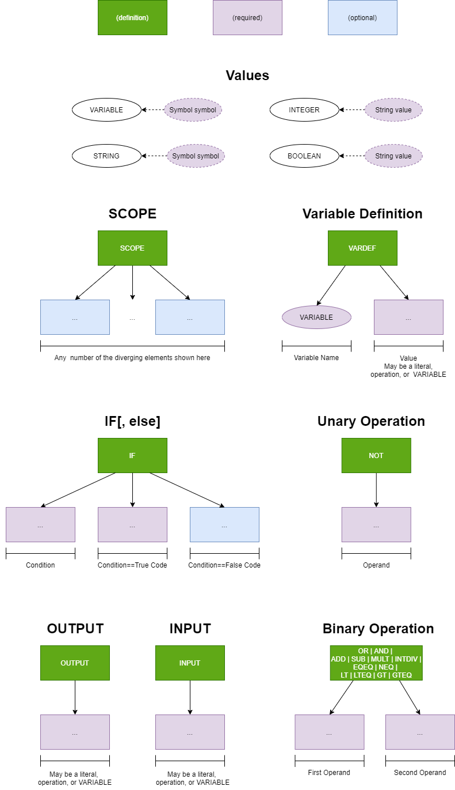
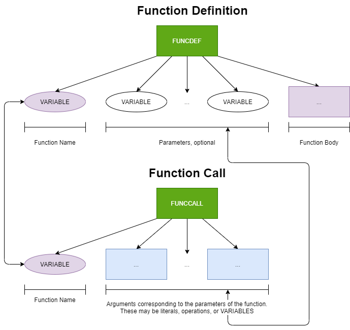
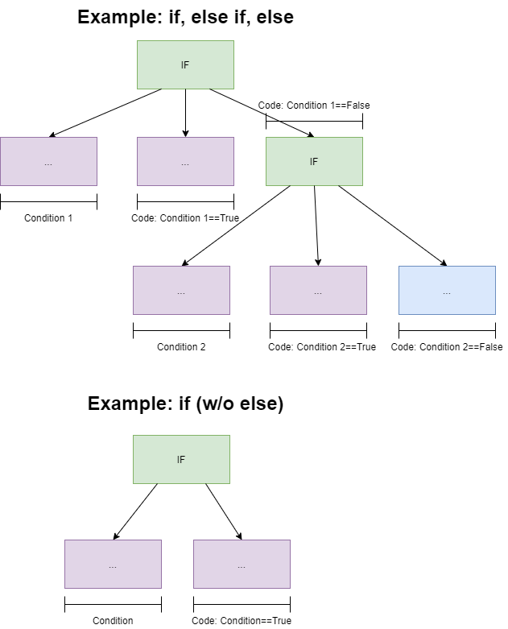
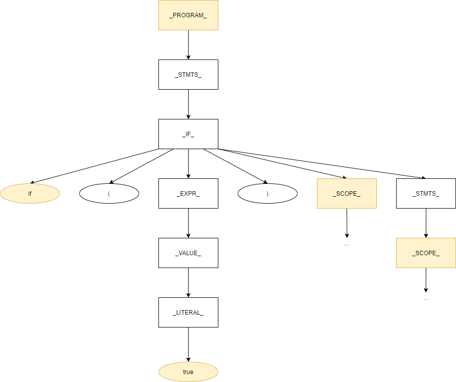
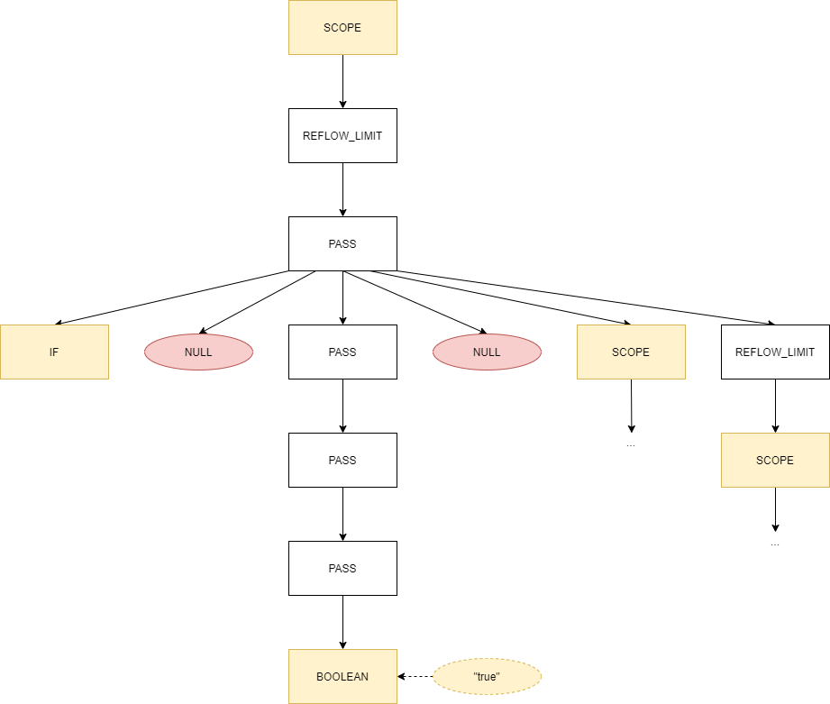
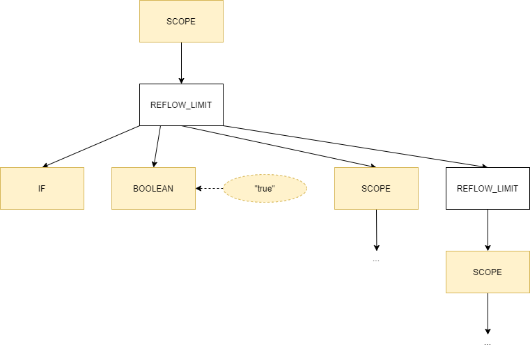
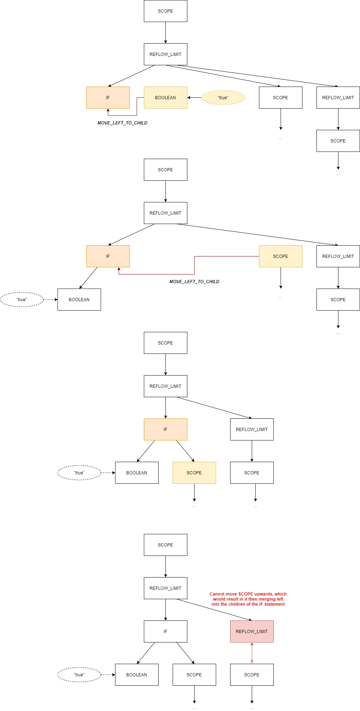
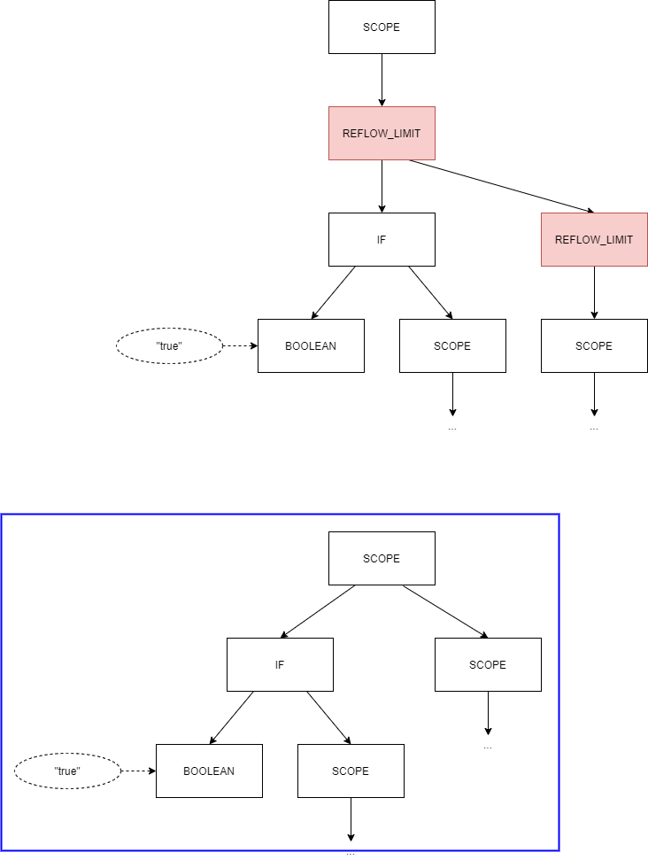
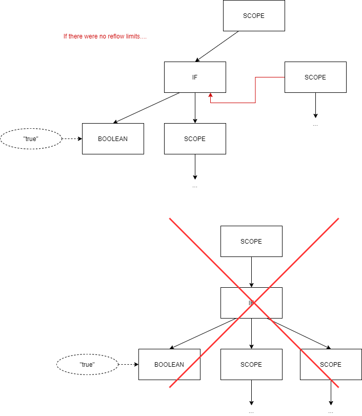

# Optimization and Reflow

The backend of the compiler can only process [elementary language constructs](#constructs "Elementary Language Constructs"), so the goal of the optimizer is to translate the raw syntax tree into a tree consisting only of these elementary language constructs. Depending on how the grammar is configured, this may or may not immediately follow from a trimming of unused nodes. Where the elementary language constructs do *not* follow from this, there are programmable [reflow bindings](#reflow "Reflow Bindings"). 

In practice, optimization results in an extensive decrease in size of the syntax tree and a much-more readable XML structure.


<a id="constructs" />

## Elementary Language Constructs

The following are diagrams of the elementary language constructs available at the time of this writing. 

Green backgrounds represent definitions. Lavender background represent required nodes. Blue backgrounds represent optional nodes.








You may notice a few oddities about the literal nodes. Strings are stored as symbols, and other types are stored as strings! String literals end up in a string pool, so they have been stored in the symbol table as referenceable symbols. The other literal types are stored as the string that was originally pulled by the lexer. They will be properly converted in the backend.

Otherwise, the elementary constructs are quite straight-forward. Every component of control flow or operation is a node.

To better demonstrate the functionality of these constructs, see the examples below.




In this way, `if, else if, else` code results in a single subtree rooted at the initial `if`.  For any of the `Code` nodes above (second and third children of an `IF` node), these too can be extended to multiple statements. A common way you will see this is by creating a `SCOPE` block, which has any number of children, executed in order as statements.


<a id="basic" />

## Basic Optimization

Each one of the original grammar rules is linked in some way to elementary construct types. For those that do not show up in the final syntax tree, they may be either ***REFLOW_LIMIT***, ***PASS*** or ***NULL***. 

* ***NULL*** indicates a leaf node that will be ignored. 
* ***PASS*** indicates that this is not a leaf node, but it is not to be added to to the final syntax tree. 
* ***REFLOW_LIMIT***  indicates that this is not a leaf node; it is not to be added to the tree; and no [reflow bindings](#reflow "Reflow Bindings") may cross this node. It acts as a boundary for reflow bindings.


The best way to understand optimization is to look at the process as it happens. Consider the following code.

```
// An if statement, its condition, and its body
if (true) {...} 

// Some other code block with it's own scope
{...}
```


Following the given [CFG rules](LANGUAGE.md "Prepackaged Language Grammar"), the raw syntax tree will be as follows.





This tree is much more verbose than the assembler wishes to receive. In fact, the only nodes we actually care about are highlighted in yellow above. Because each grammar rule is linked to an elementary construct type, we look at the tree in terms of these.





Right off the bat, any ***NULL*** leaf nodes can be dropped. They are in no way considered for the final tree. Otherwise, the nodes that we do not care about have either become ***PASS*** nodes or ***REFLOW_LIMIT*** nodes. During first-stage conversion, we crawl the raw syntax tree and create a new optimized syntax tree while ignoring any ***NULL*** or ***PASS***  nodes. By crossing ***PASS*** nodes, all we do is push the child (or children) up the tree structure until we hit a type of node that we are not currently going to drop. The resulting stage-1 optimized syntax tree would appear as follows.




From here, reflow bindings must be applied.


<a id="reflow" />

## Reflow Bindings

Reflow bindings are certain rules for reorganizing the syntax tree so that the resulting syntax tree corresponds to the [elementary language constructs](#constructs "Elementary Language Constructs") listed above. At the time of writing, the current full list of bindings are as follows. The [language information spreadsheet](GrammarAndReflow.xlsx "Grammar and Reflow Spreadsheet") may be more up-to-date.

| Elementary  Language Constructs | Temporary? |
| ------------------------------- | ---------- |
| ***REFLOW_LIMIT***              | ***X***    |
| ***PASS***                      | ***X***    |
| ***SCOPE***                     |            |
| ***IF***                        |            |
| ***FUNCDEF***                   |            |
| ***VARDEF***                    |            |
| ***FUNCCALL***                  |            |
| ***OPERATION***                 |            |
| ***OUTPUT***                    |            |
| ***INPUT***                     |            |
| ***PARAMETERS***                | ***X***    |
| ***ARGUMENTS***                 | ***X***    |
| ***NULL***                      | ***X***    |
| ***VARIABLE***                  |            |
| ***LITERAL***                   |            |


| Available Binding           | Description                                                  |
| --------------------------- | ------------------------------------------------------------ |
| ***MOVE_RIGHT_TO_CHILD***   | If the target node is the first sibling on the right of the source node, move the source node to the front of the target node's children. |
| ***MOVE_LEFT_TO_CHILD***    | If the target node is the first sibling on the left of the source node, move the source node to the end of the target node's children. |
| ***MOVE_UPWARDS_AND_LEFT*** | Move this node upwards and to the left.                      |


| Source  Language Construct | Target Language Construct | REFLOW BINDING              | Resulting Language Construct |
| -------------------------- | ------------------------- | --------------------------- | ---------------------------- |
| ***VARIABLE***             | ***FUNCDEF***             | ***MOVE_RIGHT_TO_CHILD***   | ***FUNCDEF***                |
| ***VARIABLE***             | ***FUNCCALL***            | ***MOVE_RIGHT_TO_CHILD***   | ***FUNCCALL***               |
| ***VARIABLE***             | ***PARAMETERS***          | ***MOVE_UPWARDS_AND_LEFT*** | ***VARIABLE***               |
| ***VARIABLE***             | ***ARGUMENTS***           | ***MOVE_UPWARDS_AND_LEFT*** | ***VARIABLE***               |
| ***VARIABLE***             | ***IF***                  | ***MOVE_LEFT_TO_CHILD***    | ***IF***                     |
| ***IF***                   | ***IF***                  | ***MOVE_LEFT_TO_CHILD***    | ***IF***                     |
| ***OPERATION***            | ***IF***                  | ***MOVE_LEFT_TO_CHILD***    | ***OPERATION***              |
| ***OPERATION***            | ***PARAMETERS***          | ***MOVE_UPWARDS_AND_LEFT*** | ***OPERATION***              |
| ***OPERATION***            | ***ARGUMENTS***           | ***MOVE_UPWARDS_AND_LEFT*** | ***OPERATION***              |
| ***LITERAL***              | ***IF***                  | ***MOVE_LEFT_TO_CHILD***    | ***LITERAL***                |
| ***LITERAL***              | ***PARAMETERS***          | ***MOVE_UPWARDS_AND_LEFT*** | ***LITERAL***                |
| ***LITERAL***              | ***ARGUMENTS***           | ***MOVE_UPWARDS_AND_LEFT*** | ***LITERAL***                |
| ***SCOPE***                | ***IF***                  | ***MOVE_LEFT_TO_CHILD***    | ***IF***                     |


Staying with the above example, we apply these reflow bindings. You will see below the following steps.

1. `LITERAL` (`BOOLEAN`) moves left to child of `IF`
2. `SCOPE` moves left to child of `IF`
3. The following `SCOPE` cannot pass the `REFLOW_LIMIT` node, so it stays where it is.





Finally, the `REFLOW_LIMITS` are removed.





And we have our final syntax tree! Incidentally, it is what we expect.  Below the original code has been duplicated to show the correct flow of the code is represented in the final syntax tree. The root `SCOPE` node represents the global scope. Execution runs from left to right, depth first. Thus, first the `IF` control is executed with the condition `true` such that the corresponding code runs. Next, after all relations to the `IF` condition are closed. The following code block (with its own scope) runs.


```
// An if statement, its condition, and its body
if (true) {...} 

// Some other code block with it's own scope
{...}
```


We note that if we did not have the reflow bindings, the structure would not fit that of the elementary language constructs. Furthermore, if we did not have the `REFLOW_LIMIT` nodes, we would also have an incorrect structure. See the following.





Without `REFLOW_BINDINGS`, the second `SCOPE` acts as an `ELSE` for the `IF` condition. This does not correspond with the original code.